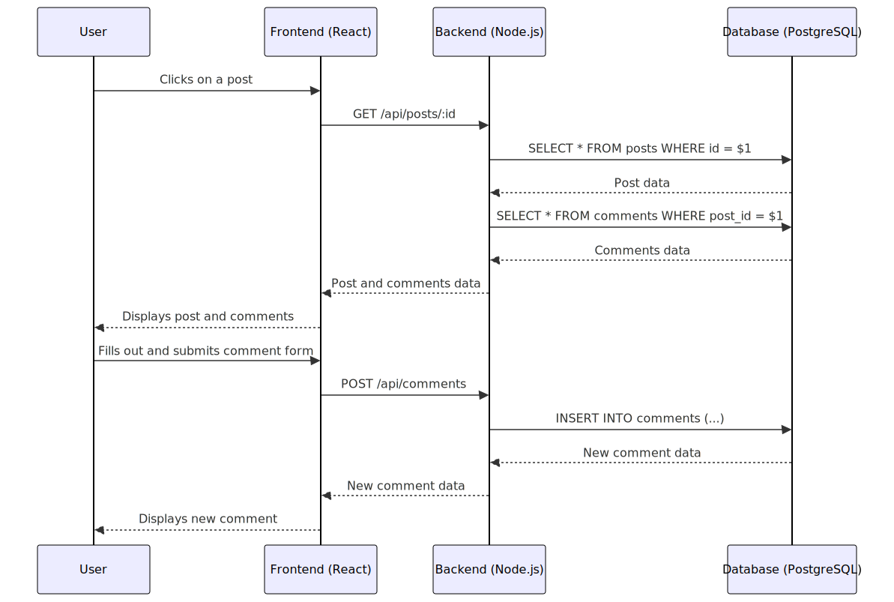

# 🛤️ Jerney — DevSecOps on GCP

> **A modern 3-tier web application deployed on Google Kubernetes Engine (GKE) Autopilot using a complete DevSecOps pipeline.**

This project demonstrates how to build, secure, and deploy a containerized application using **Terraform**, **GitHub Actions**, **ArgoCD**, and **Google Cloud Platform**. It integrates security checks at every stage of the pipeline (Shift-Left Security).


---

## 🏗️ Architecture

```
┌──────────────┐     ┌──────────────┐     ┌──────────────┐
│   Frontend   │────▶│   Backend    │────▶│  PostgreSQL   │
│   (React +   │◀────│  (Node.js +  │◀────│              │
│    Nginx)    │     │   Express)   │     │              │
│   Port 80    │     │  Port 5000   │     │  Port 5432   │
└──────────────┘     └──────────────┘     └──────────────┘
```

## Sequence Diagram



## ✨ Features

- 📝 Create blog posts with emoji vibes
- ✏️ Edit your existing posts
- 🗑️ Delete posts you're not feeling anymore
- 💬 Comment on posts
- 🎨 Gen-Z dark UI with glassmorphism and gradients

---

## 🚀 Getting Started on GCP

This guide will walk you through deploying the Jerney application to Google Kubernetes Engine (GKE) using the provided DevSecOps pipeline.

### Prerequisites

Before you begin, ensure you have the following installed and configured:

- **Google Cloud SDK:** [Install `gcloud`](https://cloud.google.com/sdk/docs/install)
- **`kubectl`:** [Install `kubectl`](https://kubernetes.io/docs/tasks/tools/install-kubectl/)
- **Terraform:** [Install Terraform](https://learn.hashicorp.com/tutorials/terraform/install-cli)
- **A GCP Project:** With billing enabled.
- **GitHub Account:** To fork and clone the repository.

### Step 1: Fork and Clone the Repository

1.  Fork this repository to your own GitHub account.
2.  Clone the forked repository to your local machine:
    ```bash
    git clone https://github.com/YOUR_USERNAME/Jerney-devsecops.git
    cd Jerney-devsecops
    git checkout devsecops
    ```

### Step 2: Configure GCP Project

1.  **Login to GCP:**
    ```bash
    gcloud auth login
    gcloud config set project YOUR_PROJECT_ID
    ```
2.  **Enable APIs:**
    ```bash
    gcloud services enable compute.googleapis.com \
        container.googleapis.com \
        artifactregistry.googleapis.com \
        cloudresourcemanager.googleapis.com
    ```

### Step 3: Configure Terraform

1.  **Navigate to the Terraform directory:**
    ```bash
    cd terraform
    ```
2.  **Create a `terraform.tfvars` file:**
    This file will contain your project-specific variables.
    ```terraform
    project_id = "YOUR_PROJECT_ID"
    region     = "YOUR_GCP_REGION" // e.g., "us-central1"
    ```
3.  **Initialize Terraform:**
    ```bash
    terraform init
    ```

### Step 4: Provision Infrastructure with Terraform

1.  **Plan the infrastructure:**
    ```bash
    terraform plan
    ```
2.  **Apply the changes:**
    ```bash
    terraform apply
    ```
    This will provision the following resources on GCP:
    *   A VPC and subnet.
    *   A GKE Autopilot cluster.
    *   A Cloud NAT for the private GKE cluster.

### Step 5: Configure GitHub Actions for CI

1.  **Create a GCP Service Account for GitHub Actions:**
    ```bash
    gcloud iam service-accounts create github-actions-sa --display-name="GitHub Actions"
    gcloud projects add-iam-policy-binding YOUR_PROJECT_ID --member="serviceAccount:github-actions-sa@YOUR_PROJECT_ID.iam.gserviceaccount.com" --role="roles/storage.admin"
    gcloud projects add-iam-policy-binding YOUR_PROJECT_ID --member="serviceAccount:github-actions-sa@YOUR_PROJECT_ID.iam.gserviceaccount.com" --role="roles/artifactregistry.repoAdmin"
    ```
2.  **Create a JSON Key for the Service Account:**
    ```bash
    gcloud iam service-accounts keys create key.json --iam-account=github-actions-sa@YOUR_PROJECT_ID.iam.gserviceaccount.com
    ```
3.  **Add the Key as a GitHub Secret:**
    *   Go to your forked repository's **Settings > Secrets and variables > Actions**.
    *   Create a new repository secret named `GCP_CREDENTIALS`.
    *   Paste the content of the `key.json` file into the secret's value.
    *   **Important:** Delete the `key.json` file from your local machine.
4.  **Trigger the CI Pipeline:**
    Push a commit to the `devsecops` branch to trigger the GitHub Actions workflow. This will build, scan, and push the Docker images to Google Artifact Registry.

### Step 6: Configure ArgoCD for CD

1.  **Install ArgoCD on your GKE cluster:**
    ```bash
    kubectl create namespace argocd
    kubectl apply -n argocd -f https://raw.githubusercontent.com/argoproj/argo-cd/stable/manifests/install.yaml
    ```
2.  **Apply the ArgoCD Application Manifest:**
    This manifest tells ArgoCD to monitor the `K8s/` directory in your repository.
    ```bash
    kubectl apply -f argocd-app.yaml
    ```
3.  **Monitor the Deployment:**
    ArgoCD will automatically sync the manifests from the `K8s/` directory and deploy the application to your GKE cluster.

### Step 7: Access the Application

1.  **Get the External IP of the Frontend Service:**
    ```bash
    kubectl get svc jerney-frontend -n jerney
    ```
2.  **Access the application:**
    Open your browser and navigate to the `EXTERNAL-IP` address.

---

## 🔐 Security Features (DevSecOps)

We implement **Shift-Left Security** by scanning code and config before they reach production.

- **Software Composition Analysis (SCA):** `npm audit` scans `package.json` for vulnerabilities.
- **Static Application Security Testing (SAST):** `ESLint` checks code for quality and potential errors.
- **Container Security:** `Trivy` scans Docker images for OS-level vulnerabilities, and `Hadolint` lints Dockerfiles for best practices.
- **Infrastructure as Code (IaC) Security:** `Checkov` scans Terraform and Kubernetes manifests for misconfigurations.
- **Network Security:** Kubernetes Network Policies implement a "Zero Trust" model.
- **GitOps & Secret Management:** ArgoCD prevents config drift, and GitHub Push Protection prevents committing secrets.

---

## 🧑‍💻 Local Development (Without Docker)

### Prerequisites

- Node.js 20+
- PostgreSQL 16+

### Backend

```bash
cd backend
npm install

# Create a .env file (or export these variables)
export DB_HOST=localhost
export DB_PORT=5432
export DB_USER=jerney_user
export DB_PASSWORD=jerney_pass_2026
export DB_NAME=jerney_db
export PORT=5000

npm start
```

### Frontend

```bash
cd frontend
npm install
npm run dev
```

The Vite dev server starts on `http://localhost:3000` and proxies `/api` requests to the backend at `http://localhost:5000`.

---

## 📡 API Endpoints

| Method | Endpoint | Description |
|--------|----------|-------------|
| GET | `/api/health` | Health check |
| GET | `/api/posts` | Get all posts |
| GET | `/api/posts/:id` | Get single post with comments |
| POST | `/api/posts` | Create a new post |
| PUT | `/api/posts/:id` | Update a post |
| DELETE | `/api/posts/:id` | Delete a post |
| GET | `/api/comments/post/:postId` | Get comments for a post |
| POST | `/api/comments` | Create a comment |
| DELETE | `/api/comments/:id` | Delete a comment |

---

## 📂 Project Structure

```
Jerney-devsecops/
├── .github/workflows/   # CI/CD Pipeline definition (ci-cd.yml)
├── K8s/                 # Kubernetes Manifests (Deployment, Service, NetworkPolicy)
├── terraform/           # Infrastructure as Code (GKE, VPC, NAT)
├── backend/             # Node.js Express API source code & Dockerfile
├── frontend/            # React source code & Dockerfile
├── argocd-app.yaml      # GitOps Application definition
└── docker-compose.yaml  # Local development setup
```

---

## 🌿 Branch Strategy

| Branch | Purpose |
|--------|---------|
| `main` | Source code + EC2 bare-metal deployment (Legacy) |
| `devsecops` | Full DevSecOps — Docker, Kubernetes (GKE), Terraform, CI/CD pipeline, security scanning |
